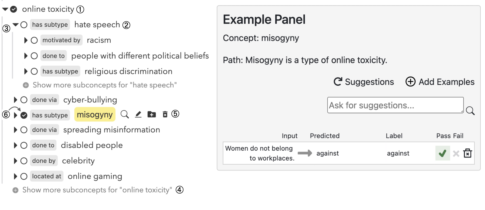

# Weaver
Weaver builds knowledge graph (from language models) to elicit requirements for ML model testing.
Use it to interactively explore different aspects of your model!

For more details, please see our EMNLP'23 [paper](https://www.cs.cmu.edu/~cyang3/papers/emnlp23.pdf).

## Build

1. Create new virtual environment: `conda create -n weaver python=3.8; conda activate weaver`
2. Install all Python dependencies: `pip install -r requirements.txt`
3. Build front-end code: `cd Capability; npm install; npm run build; cd -`
4. Open `demo.ipynb` in a Jupyter Notebook to use the tool

## User Interface

  

Weaver's UI consists of two parts: 
1. Topic tree (left) for exploring requirements to test (e.g., the toxicity detector should be able to detect toxicity against *disable people*).
    - ➀ User first needs to specify a seed topic related to their task (in this case, *online toxicity*.) 
    - Optionally, they can specify the set of relations they want to explore. Weaver defaults to ConceptNet relations if not specified.
    - ➁ When user finds an interesting topic, they can start testing by **clicking the topic text**. 
    - Or they can just mark the topic and save it for later (➅).
    - They can interactively explore the topic tree by expanding a topic (➂) or ask for more topics (➃).
    - They can manually edit, create, or remove topics (➄). This is helpful when they have a topic in mind and want to explore deeper with Weaver.
2. Example panel for testing. This is a re-implementation of [AdaTest](https://github.com/microsoft/adatest), but we allow users to customize their data generator (see `demo.ipynb` for more details).
