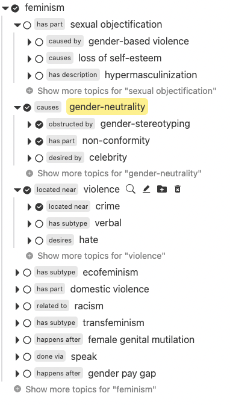
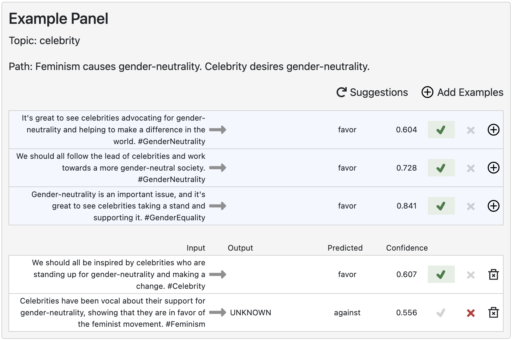

## Main-View: Topic Tree

The main view of this tool is a **topic tree** that helps users to explore related topics/conceprs for a given ML task. 

Suppose our task is to detect a sentence's stance on feminism and the seed topic is **feminism**. The topic tree will show related topics (e.g., sex objectification, gender pay gap) along with their relation to the parent topic.

  

### Topics and relations
Each node in the tree is a topic along with its relation to the parent topic.
For example, 'feminism' has a subtype 'ecofeminism'.
Four different actions will also show up when you float over a topic.

  

### Creating examples
When you find an interesting topic, you could click on <svg stroke="currentColor" fill="currentColor" stroke-width="0" viewBox="0 0 16 16" height="1em" width="1em" xmlns="http://www.w3.org/2000/svg"><path fill-rule="evenodd" d="M10.442 10.442a1 1 0 011.415 0l3.85 3.85a1 1 0 01-1.414 1.415l-3.85-3.85a1 1 0 010-1.415z" clip-rule="evenodd"></path><path fill-rule="evenodd" d="M6.5 12a5.5 5.5 0 100-11 5.5 5.5 0 000 11zM13 6.5a6.5 6.5 0 11-13 0 6.5 6.5 0 0113 0z" clip-rule="evenodd"></path></svg> or simply the topic name to start creating examples. 
See [next section](#crafting-examples) for details on using the Example Panel.

### Exploring More Topics
After you run out of interesting topics to explore, you could always expand a topic by clicking on <svg stroke="currentColor" fill="currentColor" stroke-width="0" viewBox="0 0 16 16" height="1em" width="1em" xmlns="http://www.w3.org/2000/svg"><path d="M5.56 14L5 13.587V2.393L5.54 2 11 7.627v.827L5.56 14z"></path></svg>. Relevant sub-topics will show up.

If you want to see more sub-topics for a given topic, just click on the line <svg stroke="currentColor" fill="currentColor" stroke-width="0" viewBox="0 0 16 16" height="1em" width="1em" xmlns="http://www.w3.org/2000/svg" style="color: grey; opacity: 0.8;"><path fill-rule="evenodd" d="M16 8A8 8 0 110 8a8 8 0 0116 0zM8.5 4a.5.5 0 00-1 0v3.5H4a.5.5 0 000 1h3.5V12a.5.5 0 001 0V8.5H12a.5.5 0 000-1H8.5V4z" clip-rule="evenodd"></path></svg> Show more topics for "topic".

### Adding/Deleting Topics Manually
Alternatively, you could also add manual topics you find interesting by clicking on <svg stroke="currentColor" fill="currentColor" stroke-width="0" viewBox="0 0 512 512" height="1em" width="1em" xmlns="http://www.w3.org/2000/svg"><path d="M464,128H272L208,64H48A48,48,0,0,0,0,112V400a48,48,0,0,0,48,48H464a48,48,0,0,0,48-48V176A48,48,0,0,0,464,128ZM359.5,296a16,16,0,0,1-16,16h-64v64a16,16,0,0,1-16,16h-16a16,16,0,0,1-16-16V312h-64a16,16,0,0,1-16-16V280a16,16,0,0,1,16-16h64V200a16,16,0,0,1,16-16h16a16,16,0,0,1,16,16v64h64a16,16,0,0,1,16,16Z"></path></svg>.
Delete irrelvant topics by clicking on <svg stroke="currentColor" fill="currentColor" stroke-width="0" viewBox="0 0 24 24" height="1em" width="1em" xmlns="http://www.w3.org/2000/svg"><path d="M6 19c0 1.1.9 2 2 2h8c1.1 0 2-.9 2-2V7H6v12zm2.46-7.12l1.41-1.41L12 12.59l2.12-2.12 1.41 1.41L13.41 14l2.12 2.12-1.41 1.41L12 15.41l-2.12 2.12-1.41-1.41L10.59 14l-2.13-2.12zM15.5 4l-1-1h-5l-1 1H5v2h14V4z"></path></svg>.

### Highlighting Topics
The topics will be automatically highlighted 
(checked <svg stroke="currentColor" fill="currentColor" stroke-width="0" viewBox="0 0 24 24" height="1em" width="1em" xmlns="http://www.w3.org/2000/svg"><g><path fill="none" d="M0 0h24v24H0z"></path><path d="M12 22C6.477 22 2 17.523 2 12S6.477 2 12 2s10 4.477 10 10-4.477 10-10 10zm-.997-6l7.07-7.071-1.414-1.414-5.656 5.657-2.829-2.829-1.414 1.414L11.003 16z"></path></g></svg>) 
when you start adding examples. You can manually unhighlight topics you no longer find interesting or find hard to exploit 
(<svg stroke="currentColor" fill="currentColor" stroke-width="0" viewBox="0 0 24 24" height="1em" width="1em" xmlns="http://www.w3.org/2000/svg"><g><path fill="none" d="M0 0h24v24H0z"></path><path d="M12 22C6.477 22 2 17.523 2 12S6.477 2 12 2s10 4.477 10 10-4.477 10-10 10zm0-2a8 8 0 1 0 0-16 8 8 0 0 0 0 16z"></path></g></svg>).

## Crafting Examples

The example panel shows all examples you create for a given topic. 
In the user study, we expect you to find at least **three** failing examples before moving on to other topics.

  

You could start crafting examples by either asking for model suggestions 
(<svg stroke="currentColor" fill="currentColor" stroke-width="0" viewBox="0 0 512 512" height="1em" width="1em" xmlns="http://www.w3.org/2000/svg"><path d="M500.33 0h-47.41a12 12 0 0 0-12 12.57l4 82.76A247.42 247.42 0 0 0 256 8C119.34 8 7.9 119.53 8 256.19 8.1 393.07 119.1 504 256 504a247.1 247.1 0 0 0 166.18-63.91 12 12 0 0 0 .48-17.43l-34-34a12 12 0 0 0-16.38-.55A176 176 0 1 1 402.1 157.8l-101.53-4.87a12 12 0 0 0-12.57 12v47.41a12 12 0 0 0 12 12h200.33a12 12 0 0 0 12-12V12a12 12 0 0 0-12-12z"></path></svg> Suggestions) 
or writing your own examples 
(<svg stroke="currentColor" fill="currentColor" stroke-width="0" viewBox="0 0 24 24" height="1em" width="1em" xmlns="http://www.w3.org/2000/svg"><path fill="none" stroke="#000" stroke-width="2" d="M12,22 C17.5228475,22 22,17.5228475 22,12 C22,6.4771525 17.5228475,2 12,2 C6.4771525,2 2,6.4771525 2,12 C2,17.5228475 6.4771525,22 12,22 Z M12,18 L12,6 M6,12 L18,12"></path></svg> Add Examples).

Click the textbox to edit the inputs. Submit the edits by 'Enter'. Model predictions and confidence will be updated upon submission.

### Adding suggested examples
The suggested examples will be in a blue background color. If you find a suggested example interesting, add it to the user examples by clicking on 
<svg stroke="currentColor" fill="currentColor" stroke-width="0" viewBox="0 0 24 24" height="1em" width="1em" xmlns="http://www.w3.org/2000/svg"><path fill="none" stroke="#000" stroke-width="2" d="M12,22 C17.5228475,22 22,17.5228475 22,12 C22,6.4771525 17.5228475,2 12,2 C6.4771525,2 2,6.4771525 2,12 C2,17.5228475 6.4771525,22 12,22 Z M12,18 L12,6 M6,12 L18,12"></path></svg> or [marking examples as pass/fail](#marking-examples-as-passfail).
Make sure you add all interesting suggestions before refreshing.

### Marking examples as pass/fail
All examples will be marked as pass by default. You should inspect examples carefully and determine whether the predictions match the ground truth. If yes, click on <svg stroke="currentColor" fill="currentColor" stroke-width="0" version="1.2" baseProfile="tiny" viewBox="0 0 24 24" height="1em" width="1em" xmlns="http://www.w3.org/2000/svg" style="color: rgb(61, 125, 68); font-size: 25px; opacity: 1;"><path d="M16.972 6.251c-.967-.538-2.185-.188-2.72.777l-3.713 6.682-2.125-2.125c-.781-.781-2.047-.781-2.828 0-.781.781-.781 2.047 0 2.828l4 4c.378.379.888.587 1.414.587l.277-.02c.621-.087 1.166-.46 1.471-1.009l5-9c.537-.966.189-2.183-.776-2.72z"></path></svg> to confirm.
Otherwise, click on
<svg stroke="currentColor" fill="currentColor" stroke-width="0" version="1.1" viewBox="0 0 16 16" height="1em" width="1em" xmlns="http://www.w3.org/2000/svg" style="color: rgb(190, 53, 53); font-size: 12px; opacity: 1;"><path d="M15.854 12.854c-0-0-0-0-0-0l-4.854-4.854 4.854-4.854c0-0 0-0 0-0 0.052-0.052 0.090-0.113 0.114-0.178 0.066-0.178 0.028-0.386-0.114-0.529l-2.293-2.293c-0.143-0.143-0.351-0.181-0.529-0.114-0.065 0.024-0.126 0.062-0.178 0.114 0 0-0 0-0 0l-4.854 4.854-4.854-4.854c-0-0-0-0-0-0-0.052-0.052-0.113-0.090-0.178-0.114-0.178-0.066-0.386-0.029-0.529 0.114l-2.293 2.293c-0.143 0.143-0.181 0.351-0.114 0.529 0.024 0.065 0.062 0.126 0.114 0.178 0 0 0 0 0 0l4.854 4.854-4.854 4.854c-0 0-0 0-0 0-0.052 0.052-0.090 0.113-0.114 0.178-0.066 0.178-0.029 0.386 0.114 0.529l2.293 2.293c0.143 0.143 0.351 0.181 0.529 0.114 0.065-0.024 0.126-0.062 0.178-0.114 0-0 0-0 0-0l4.854-4.854 4.854 4.854c0 0 0 0 0 0 0.052 0.052 0.113 0.090 0.178 0.114 0.178 0.066 0.386 0.029 0.529-0.114l2.293-2.293c0.143-0.143 0.181-0.351 0.114-0.529-0.024-0.065-0.062-0.126-0.114-0.178z"></path></svg> to mark it as fail.

The output (ground truth) will be automatically updated when you mark examples (same as predictions when pass; "UNKNOWN" otherwise). Optionally, you could edit the outputs to reflect what you desire.

### Organizing examples
Sometimes examples will fit better in another topic when you further explore the topic tree. In that case, just drag the example to that topic for better organization.

## Undoing Actions
If you accidentally perform any incorrect actions, you could always undo it by clicking on
<svg stroke="currentColor" fill="currentColor" stroke-width="0" viewBox="0 -3 10 16" size="30" height="30" width="30" xmlns="http://www.w3.org/2000/svg"><path fill-rule="evenodd" d="M6 3L0 8l6 5v-3h4V6H6V3z"></path></svg> at the upper-left corner. Alternatively, you could also use keyboard shortcuts Ctrl/Cmd +Z.

## Summarizing findings
Use the toggle (Checked Topics Only: <svg stroke="currentColor" fill="currentColor" stroke-width="0" viewBox="0 -2 16 16" size="25" height="25" width="25" xmlns="http://www.w3.org/2000/svg"><path fill-rule="evenodd" d="M5 3a5 5 0 000 10h6a5 5 0 000-10H5zm6 9a4 4 0 100-8 4 4 0 000 8z" clip-rule="evenodd"></path></svg>) to show only the highlighted topics. You could use it to view all topics you have explored and summarize your findings.